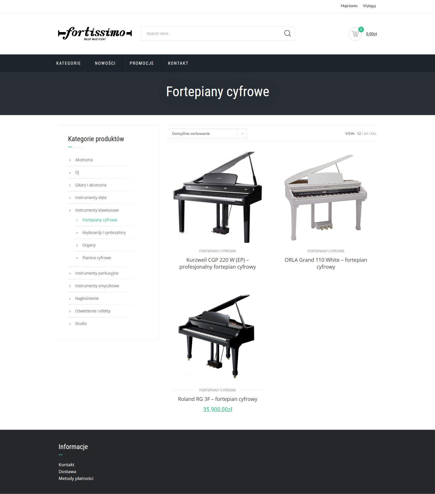

# Fortissimo
Fortissimo is a music store written in Wordpress. It offers a wide range of musical instruments, various accessories, effects, sound and lighting equipment, and disco equipment. It provides advice and has many years of experience in the selection of goods and equipment configuration.


## Table of contents
* [Technology](#technology)
* [Installation](#installation)
* [Screenshots](#screenshots)


## Technology
Project is created with:
* Wordpress - version 5.5.1


## Installation

1. Clone the repository
	```
	git clone https://github.com/Alakul/Fortissimo.git
	```

2. Start Apache and MySQL server in XAMPP Control Panel

3. Open website
	```
	http://localhost/Fortissimo/wp-login.php
	```

4. Log in using the details below
	```
	Login: Alakul
	Password: g4hSk6ATKHd)kJK$wD
	```

	
## Screenshots
<p>
    
    <em>Products page</em>
</p>